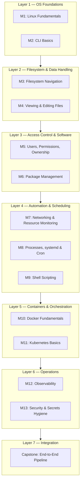
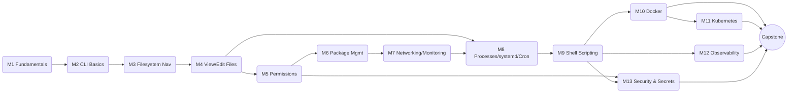
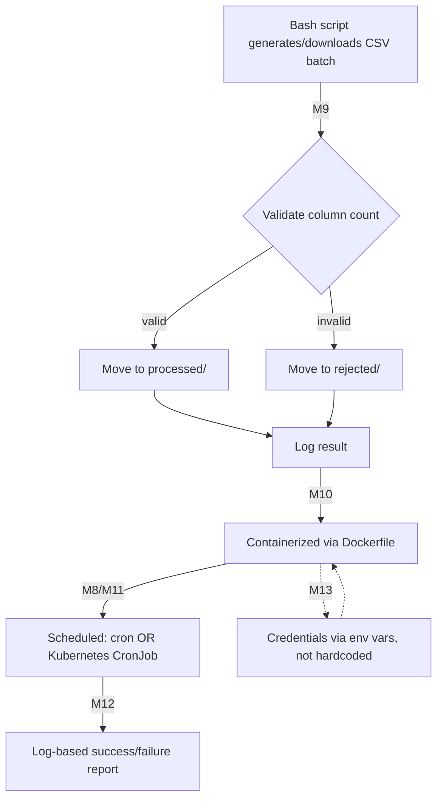

# Linux Training for Data Engineers — Architecture Document

**Source curriculum:** *Linux Training for Data Engineers: Beginner to Intermediate* (Sep 17, 2026 · @jemv)
**Purpose of this document:** translate the 13-module written curriculum into an architecture view — how the modules layer on top of one another, how they depend on each other, and how they converge into the capstone system.

---

## 1. Curriculum Architecture Overview

The course is architected as a **layered stack**, mirroring how a real data infrastructure stack is layered on Linux. Each layer assumes the layer below it is solid.

**Design principle:** each layer removes one class of "silent failure" a data engineer hits in production —

| Layer | Removes this failure mode |
|---|---|
| L1 Foundations | "I don't know what's happening under the hood" |
| L2 Filesystem | "I can't find the log / config / data file" |
| L3 Access & Software | "Permission denied" / "works on my machine" |
| L4 Automation | "The job didn't run" / manual, error-prone toil |
| L5 Containers | "It broke when it moved to another machine" |
| L6 Operations | "It failed silently and nobody noticed" |
| L7 Integration | Untested assumptions about how the pieces fit together |

---

## 2. Module Dependency Graph

Modules are not independent — each hands a specific capability to the next. The graph below shows real prerequisite edges (not just sequential numbering).

**Key dependency notes:**
- **M9 (Shell Scripting)** is the central hinge of the course — it's the last "core skill" module and feeds directly into Docker (M10), Observability (M12), and Security (M13).
- **M5 (Permissions)** is a dependency for both package management (M6) and security hygiene (M13) — permissions are treated as a recurring theme, not a one-off topic.
- **M10 → M11** is a hard dependency: Kubernetes' hands-on lab explicitly deploys the container built in M10.
- The **Capstone** is the only module with four converging inputs (M10, M11, M12, M13), plus indirect dependence on M9 through all of them — it is architected as an integration test of the whole stack, not a new topic.

---

## 3. Weekly Delivery Architecture

| Week | Modules | Architectural Focus | Est. Hours |
|---|---|---|---|
| 1 | M1–M2 | Foundations layer | 5–6 |
| 2 | M3–M4 | Filesystem/data layer | 5–6 |
| 3 | M5–M6 | Access & software layer | 5–6 |
| 4 | M7–M9 | Automation layer | 7–8 |
| 5 | M10–M11 | Container/orchestration layer | 6–7 |
| 6 | M12–M13 + Capstone | Operations layer + integration | 7–8 |

*Compressed track:* 2 weeks full-time = 1 week of content per 1–2 days, layer order unchanged.

---

## 4. Per-Module Component Architecture

| Module | Core Components Introduced | Primary Tools/Commands | Output Artifact (from lab) |
|---|---|---|---|
| M1 | Kernel, shell, distro, filesystem-as-abstraction | `uname -a`, `cat /etc/os-release`, `top` | Written observation notes |
| M2 | Command syntax, pipes, redirection | `\|`, `>`, `>>`, `man`, tab-completion | Redirected file listing |
| M3 | FHS directory layout, path resolution | `pwd`, `cd`, `ls`, `find`, `mkdir -p` | Nested project directory structure |
| M4 | Stream viewing, in-place editing, pattern search | `cat`, `less`, `tail -f`, `grep`, `nano`/`vim` | Filtered log excerpt |
| M5 | Identity model, permission bits, ownership | `chmod`, `chown`, `chgrp`, `sudo` | Access-restricted shared directory |
| M6 | Package manager, repositories, language-level package managers | `apt`/`yum`, `pip`, `conda` | Verified JDK + Python package install |
| M7 | Networking primitives, resource metrics | `curl`, `scp`, `ss`, `df -h`, `free -h` | Confirmed disk/memory headroom check |
| M8 | Process lifecycle, service management, scheduling | `ps`, `kill`, `systemctl`, `journalctl`, `crontab` | Cron job producing timestamped log |
| M9 | Control flow, functions, exit-code handling | `if/for/while`, `$?`, `sed`/`awk` | CSV validator/router script |
| M10 | Image/container model, Dockerfile, volumes | `docker build`, `docker run`, `docker logs` | Containerized CSV summary script |
| M11 | Pods, Deployments, Services, control plane | `kubectl get/logs`, manifests | Deployed + exposed containerized workload |
| M12 | Logs/metrics/traces, structured logging | `grep`/`awk` pipelines, dashboards | Daily processed/rejected report |
| M13 | Least privilege, secrets management, secure transfer | env vars, `.gitignore`, `scp`/`sftp` | Script refactored to remove hardcoded credentials |

---

## 5. Capstone: End-to-End Pipeline Architecture

The capstone is the course's "systems integration" deliverable — it wires together automation, containerization, scheduling, observability, and security into one running pipeline.

**Architectural requirements the capstone enforces:**
1. **Idempotent automation** — script (M9) must handle repeated runs without manual cleanup.
2. **Portability** — containerization (M10) so the pipeline behaves identically across dev/CI/prod.
3. **Reliable scheduling** — either cron (M8) or a Kubernetes CronJob (M11); both are acceptable, reflecting real-world variation in orchestration maturity.
4. **Observability by design** — the log format from M9 must be structured enough for the M12 grep/awk report to parse.
5. **Security baked in, not bolted on** — M13's environment-variable pattern and `.gitignore` rule are applied to the *same* script from M9, not a separate exercise.

**Validation criterion:** the pipeline must be run at least once with a deliberately malformed file to prove the failure path (validation → `rejected/` → logged → visible in the M12 report) actually works — i.e., the architecture is tested under failure, not just the happy path.

---

## 6. Assessment Architecture

| Checkpoint | What it validates |
|---|---|
| Per-module hands-on lab | Layer-by-layer competence before advancing |
| Capstone end-to-end run | Cross-layer integration |
| Deliberate failure injection | Error-handling and observability actually work, not just exist |
| Self-check (M1–M2 recall) | Foundational model retained ("what happens between typing a command and seeing output?") |

---

## 7. Resource Map (by architectural layer)

| Layer | Modules | Key Resources |
|---|---|---|
| Foundations | M1 | *What Is Linux? From Kernel to IoT* (video) |
| Filesystem | M3–M4 | *Linux Filesystem Explained*, *File System Structure Explained* (video), *Basic Linux Navigation and File Management*, *Viewing and Editing Files from the Terminal* |
| Access & Software | M5 | *Linux File Permissions Explained* (Red Hat), *User and File System Privileges* |
| Automation | M8–M9 | *Systemd, Systemctl, Journalctl*, *Bash Scripting Tutorial*, *Shell Scripting for Beginners* |
| Containers/Orchestration | M10–M11 | *Container Learning Path*, *Docker Tutorial for Beginners* (video), *Docker Learning Path*, *Kubernetes Basics* (official) |
| Operations | M12–M13 | *Observability for Beginners*, *Observability for the Absolute Beginner*, *Secrets Hygiene as a Culture*, *Cyber Hygiene for Developers* |

---

*Generated as an architecture companion to the original curriculum document — reflects structure and dependencies, not new instructional content.*